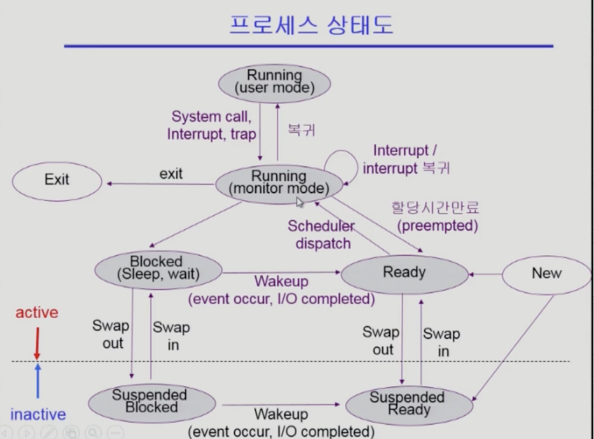
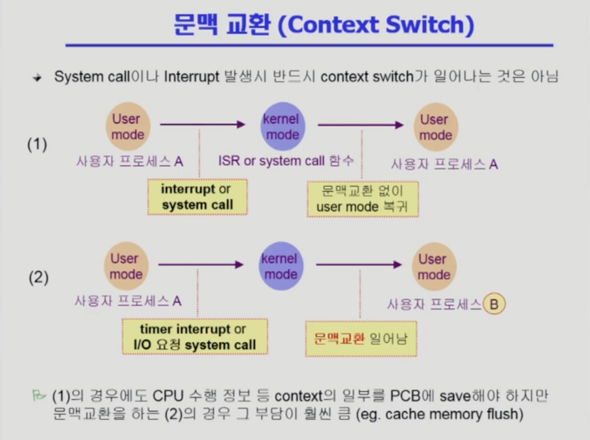

# <u>프로세스란</u>

컴퓨터 프로세스란 컴퓨터 시스템이 수행하는 작업의 일련의 절차를 의미합니다. 각 프로세스는 컴퓨터 시스템에서 수행되는 작업을 의미하며, 컴퓨터 시스템에서 실행되고 있는 여러 개의 프로세스가 동시에 실행될 수
있습니다.

프로세스는 컴퓨터 시스템에서 수행하는 작업의 일련의 절차를 의미하며, 이를 실행하기 위해서는 컴퓨터의 CPU, 메모리, 저장장치 등의 자원이 필요합니다. 컴퓨터 시스템에서 실행되고 있는 각 프로세스는 컴퓨터 시스템의
자원을 사용하게 되며, 컴퓨터 시스템은 각 프로세스가 요청하는 자원을 제공해 주게 됩니다.

## ***프로세스 상태(Process State)***

프로세스는 운영체제에서 실행되는 작업을 의미합니다. 프로세스는 운영체제에서 실행될 때, 상태가 존재합니다. 프로세스의 상태는 프로세스가 운영체제에서 실행될 때의 상태를 의미합니다.

프로세스 상태는 다음과 같은 상태가 있습니다.

- 새로운 상태(New): 프로세스가 생성되고 아직 실행되지 않은 상태
- 준비 상태(Ready): 프로세스가 실행될 준비가 된 상태
- 실행 상태(Running): 프로세스가 실행되고 있는 상태
- 완료 상태(Terminated): 프로세스가 완료된 상태
- 중지 상태(Stopped): 프로세스가 실행되고 있었지만 외부적인 이유로 중지된 상태
- 정지 상태(Suspended): 프로세스가 실행되고 있었지만 운영체제에서 정지된 상태
  

## ***프로세스 제어 블록(Process Control Block, PCB)***

프로세스 제어 블록은 프로세스가 실행되기 전에 운영체제가 생성하고, 프로세스가 실행되는 동안 관리합니다. 프로세스 제어 블록은 프로세스의 상태와 관련된 정보, 프로세스가 실행될 때 사용할 자원의 정보, 프로세스가
실행될 때 사용할 기계어 코드의 정보 등을 저장하고 있습니다.

요약하자면 프로세스 제어 블록은 단순하게는 프로세스마다 달라지는 모든 정보를 저장하는 저장소의 역할을 한다.

***PCB 구성 요소***

1) 프로세스 식별자(Process ID)

2) 프로세스 상태(Process State) : 생성(create), 준비(ready), 실행 (running), 대기(waiting), 완료(terminated) 상태가 있습니다.

3) 프로그램 계수기(Program Counter) : 프로그램 계수기는 이 프로세스가 다음에 실행할 명령어의 주소를 가리킵니다.

4) CPU 레지스터 및 일반 레지스터

5) CPU 스케줄링 정보 : 우선 순위, 최종 실행시각, CPU 점유시간 등

6) 메모리 관리 정보 : 해당 프로세스의 주소 공간 등

7) 프로세스 계정 정보 : 페이지 테이블, 스케줄링 큐 포인터, 소유자, 부모 등

8) 입출력 상태 정보 : 프로세스에 할당된 입출력장치 목록, 열린 파일 목록 등

9) 포인터 : 부모프로세스에 대한 포인터, 자식 프로세스에 대한 포인터, 프로세스가 위치한 메모리 주소에 대한 포인터, 할당된 자원에 대한 포인터 정보 등.

## ***프로세스 스케줄링***

프로세스 스케줄링은 운영체제가 컴퓨터의 자원을 효율적으로 사용할 수 있도록 프로세스를 제어하는 기능을 의미합니다. 프로세스 스케줄링은 운영체제가 컴퓨터의 자원을 적극적으로 사용할 수 있도록 프로세스의 실행 순서를
제어합니다.

## ***스케줄링 큐(Scheduling Queue)***

스케줄링 큐는 운영체제에서 실행할 프로세스를 저장하고 있으며, 스케줄링 알고리즘에 따라 프로세스의 실행 순서를 결정합니다. 스케줄링 큐는 운영체제가 컴퓨터 자원을 적극적으로 사용할 수 있도록 프로세스의 실행 순서를
제어하는 역할을 합니다.

## ***스케줄러(Scheduler)***

* 장기
    * 메모리에 프로세스가 올라가는 정도를 control
* 단기
    * 프로세스에 CPU를 주는 문제
    * 충분히 빨라야함
* 중기 -> wapper
    * 일단 메모리에 다올리고 빼았는다. -> suspend

## ***문맥 교환(Context Switch)***

문맥 교환은 컴퓨터 운영 체제가 여러 개의 프로세스를 실행할 때, 하나의 프로세스가 실행 중일 때 다른 프로세스가 실행되기 위해서 필요한 작업을 의미합니다. 컴퓨터 운영 체제는 여러 개의 프로세스를 실행할 때, 각
프로세스마다 자신의 실행 시간을 가지고 있으며, 이 시간이 지나면 컴퓨터 운영 체제가 다른 프로세스를 실행하기 위해 현재 실행 중인 프로세스의 실행을 중지하고, 다른 프로세스를 실행할 수 있도록 준비하는 과정을 문맥
교환이라고 합니다.

---

## ***프로세스 생성 및 종료***

* fork() -> 자식 프로세스 복제 생성 pid 로 구분 / 시스템 콜로 자신을 복제
* exec() -> 하나의 프로세스를 새로운 프로세스로 덮어 씌움 / 현재 실행하고 있는 프로그램을 다른 것으로 교체
* wait() -> 자식 프로세스가 동작 중이면 호출 차단이 차단되기 때문에 상태를 얻어올 때까지 대기
* exit() ->

---

## ***프로세스간 통신(Interprocess Commnunicatin, IPC)***

여러 개의 프로세스가 서로 정보를 주고받고 작업을 수행할 수 있도록 하는 기능을 의미합니다. 프로세스간 통신은 운영체제에서 제공하는 인터페이스를 사용해서 수행됩니다.

- 메시지 전달(message passing)은 컴퓨터 운영 체제에서 프로세스가 서로 정보를 주고받기 위해 사용하는 기능입니다. 운영 체제는 프로세스가 실행될 때, 각 프로세스는 자신의 작업을 수행하기 위해 필요한
  정보를 얻기 위해서 다른 프로세스로부터 정보를 요청할 수 있습니다. 이때 프로세스가 정보를 요청하기 위해 사용하는 것을 메시지 전달이라고 합니다. 메시지 전달은 컴퓨터 운영 체제에서 프로세스 간 통신을 위해
  사용되며, 일반적으로 운영 체제가 제공하는 소켓 프로그래밍 기능을 사용하여 구현됩니다. 소켓 프로그래밍은 프로세스가 소켓을 통해 정보를 주고받을 수 있도록 해주는 기능으로, 일반적으로 컴퓨터 네트워크
  프로그래밍에서도 사용됩니다.

- 공유 메모리(shared memory)는 커널의 통신 서비스를 이용해 협력하는 프로세스들 사이에 공유되는 메모리 영역(shared memory)을 구축하는 방법이다

1) 공유 메모리 모델의 특징 두 개 이상의 프로세스들이 주소 공간의 일부를 공유하며, 공유한 메모리 영역에 읽기/쓰기를 통해서 통신을 수행한다. (Read and Write)
   공유 메모리가 설정되면, 그 이후의 통신은 커널의 관여 없이 진행 가능하다.

2) 공유 메모리 모델의 장점 커널의 관여 없이 메모리를 직접 사용하여 IPC 속도가 빠르다. 프로그램 레벨에서 통신 기능을 제공하여, 자유로운 통신이 가능하다.

3) 공유 메모리 모델의 단점 구현하기 어렵다는 단점이 있다.

---